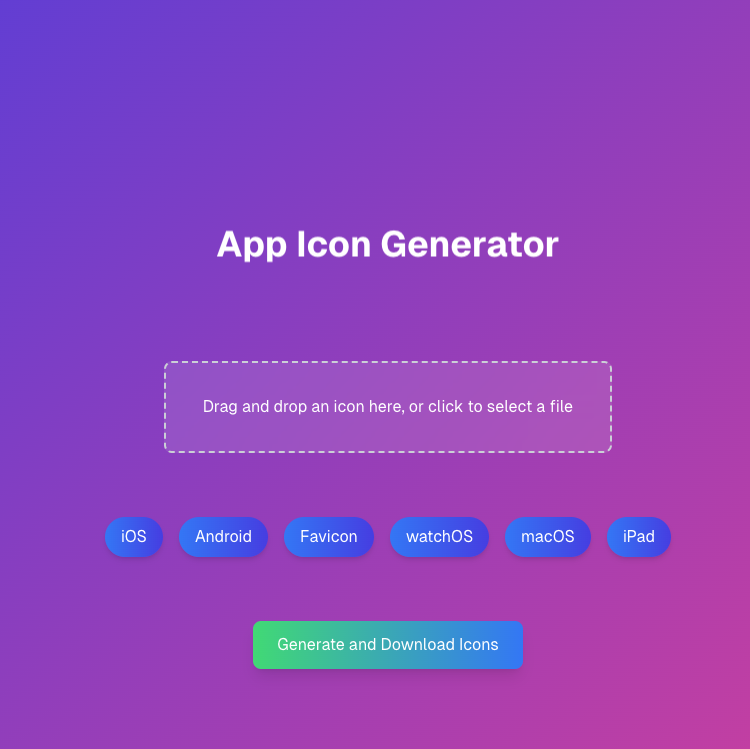
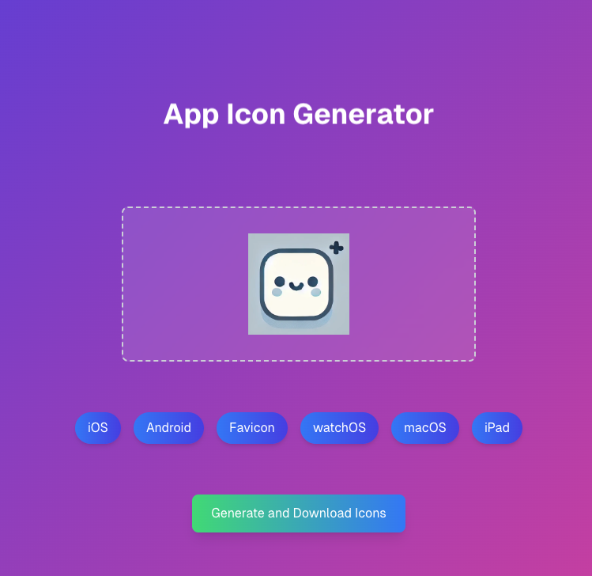
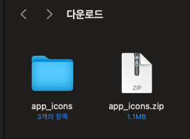
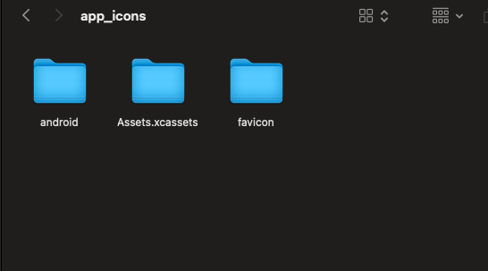
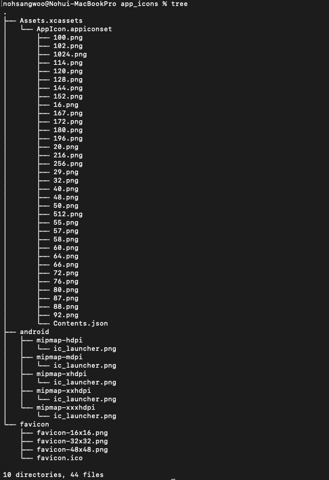

# app icon generator

Effortless and Secure Icon Generation for Web and Mobile

IconGen is a simple, yet powerful web service that allows users to effortlessly convert their app icons into all the necessary sizes for web and mobile platforms. Upload a single icon, and IconGen will generate favicon, web icons, and mobile icons in various required sizes, all processed securely on your device. Our client-side processing ensures your data is never transferred to external servers, making IconGen a privacy-safe solution.

## Key Features:

- Client-side processing ensures privacy and security
- Upload once, generate icons for all platforms
- Supports favicon and multiple web and mobile sizes
- Clean, user-friendly interface for hassle-free icon conversion
- Perfect for developers, designers, and anyone needing app icons
- Fast, reliable, and free to use

# deploy: https://icongen.ludgi.ai/

# preview

  

 

# sitemap: https://icongen.ludgi.ai/sitemap.xml

# preview
